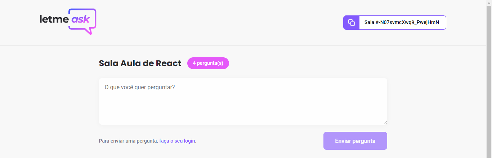

# LETMEASK
Plataforma de perguntas e respostas simultâneas entre usuários e administrador.

## Tecnologias usadas no projeto:
### REACT, TYPESCRIPT, SASS, FIREBASE

Projeto desenvolvido durante o NLW 6.